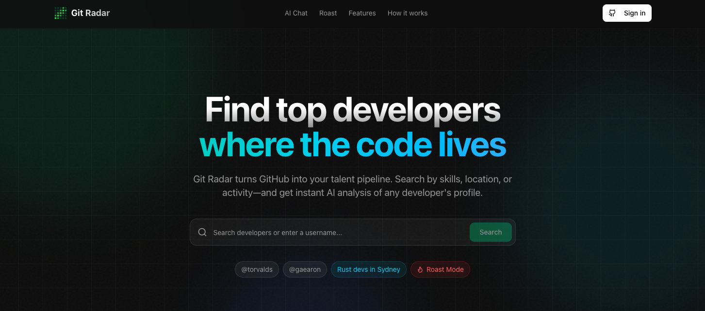
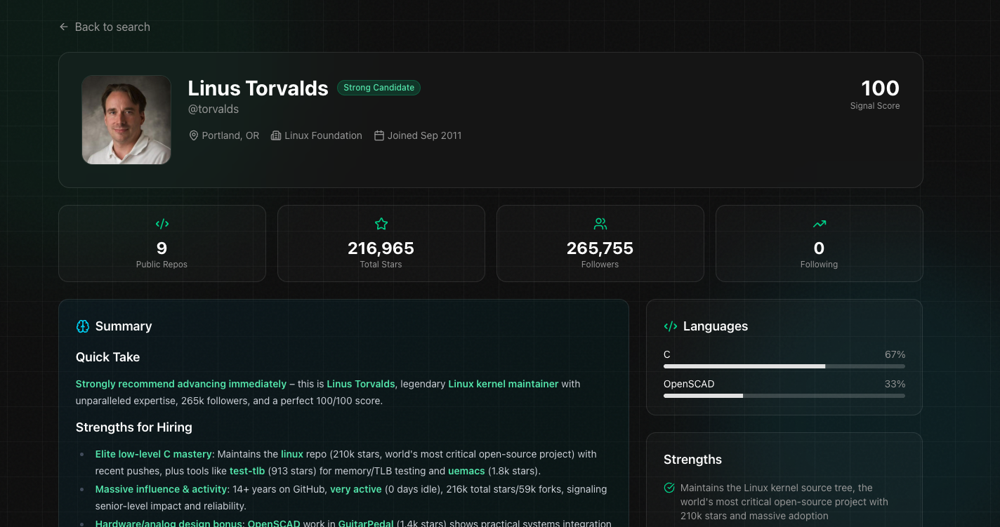

<p align="center">
  
</p>

<h1 align="center">Git Radar</h1>

<p align="center">
  <strong>AI-powered developer talent discovery and analysis platform.</strong><br/>
  Find top developers where the code lives.
</p>

<p align="center">
  <a href="#key-features">Features</a> •
  <a href="#demo">Demo</a> •
  <a href="#getting-started">Getting Started</a> •
  <a href="#tech-stack">Tech Stack</a> •
  <a href="#license">License</a>
</p>

---

## What It Does

Git Radar transforms GitHub profiles into actionable hiring insights. Search for developers using natural language queries like "Rust developers in Sydney" or analyze any GitHub profile to get an instant AI-powered assessment of their skills, activity, and collaboration patterns.

## Demo

<p align="center">
  
</p>

## Key Features

| Feature | Description |
|---------|-------------|
| **Natural Language Search** | Find developers by skills, location, or tech stack using conversational queries |
| **Profile Analysis** | Deep analysis of any GitHub profile including activity patterns and language expertise |
| **Signal Score** | 0-100 quality score based on contributions, project complexity, and engagement |
| **Collaboration Graphs** | Visualize developer networks and organizational connections |
| **Draft Emails** | AI-generated personalized outreach messages |
| **Roast Mode** | Humorous profile critiques for lighter interactions |

## Getting Started

### Prerequisites

- Node.js 18+
- pnpm (or npm/yarn/bun)
- GitHub OAuth app credentials
- Supabase project
- API keys for: Anthropic Claude or XAI Grok, Exa (web search)

### Installation

```bash
# Clone the repository
git clone <repo-url>
cd git-radar

# Install dependencies
pnpm install

# Set up environment variables
cp .env.example .env.local
# Edit .env.local with your credentials

# Run the development server
pnpm dev
```

Open [http://localhost:3000](http://localhost:3000) to see the app.

### Environment Variables

Create a `.env.local` file with the following:

```env
# Supabase
NEXT_PUBLIC_SUPABASE_URL=
NEXT_PUBLIC_SUPABASE_ANON_KEY=
SUPABASE_SERVICE_ROLE_KEY=

# AI Providers
ANTHROPIC_API_KEY=
XAI_API_KEY=

# Search
EXA_API_KEY=

# Redis (Upstash)
UPSTASH_REDIS_REST_URL=
UPSTASH_REDIS_REST_TOKEN=

# Database (for migrations)
DATABASE_URL=
```

## Tech Stack

<table>
  <tr>
    <td><strong>Frontend</strong></td>
    <td>Next.js 16, React 19, Tailwind CSS v4, Radix UI</td>
  </tr>
  <tr>
    <td><strong>Backend</strong></td>
    <td>Next.js API Routes, Vercel AI SDK</td>
  </tr>
  <tr>
    <td><strong>Database</strong></td>
    <td>PostgreSQL, Drizzle ORM</td>
  </tr>
  <tr>
    <td><strong>AI</strong></td>
    <td>Anthropic Claude, XAI Grok</td>
  </tr>
  <tr>
    <td><strong>Auth</strong></td>
    <td>Supabase Auth with GitHub OAuth</td>
  </tr>
  <tr>
    <td><strong>Search</strong></td>
    <td>Exa API</td>
  </tr>
  <tr>
    <td><strong>Caching</strong></td>
    <td>Upstash Redis</td>
  </tr>
  <tr>
    <td><strong>Visualizations</strong></td>
    <td>D3.js, Recharts, React Flow</td>
  </tr>
</table>

## Project Structure

```
app/
├── page.tsx              # Homepage
├── ai-search/            # AI chat interface
├── analyze/[username]/   # Profile analysis page
├── api/
│   ├── chat/             # AI agent endpoint
│   ├── github/           # GitHub API endpoints
│   └── analyze/          # Analysis API
└── auth/                 # OAuth callbacks

components/
├── ui/                   # Radix UI components
├── search-form.tsx       # Search with autocomplete
├── collaboration-graph.tsx
└── ...

lib/
├── actions/              # Server actions (auth, analysis)
├── github.ts             # GitHub utilities
└── supabase/             # Supabase client config

src/db/
└── schema.ts             # Drizzle ORM schema
```

## Commands

| Command | Description |
|---------|-------------|
| `pnpm dev` | Start development server |
| `pnpm build` | Production build |
| `pnpm start` | Start production server |
| `pnpm lint` | Run ESLint |
| `pnpm db:generate` | Generate migrations |
| `pnpm db:migrate` | Run migrations |
| `pnpm db:push` | Push schema to database |
| `pnpm db:studio` | Open Drizzle Studio |

## How It Works

```
┌─────────────────┐    ┌─────────────────┐    ┌─────────────────┐    ┌─────────────────┐
│                 │    │                 │    │                 │    │                 │
│  1. Search      │───▶│  2. AI Analysis │───▶│  3. Results     │───▶│  4. Action      │
│                 │    │                 │    │                 │    │                 │
│  Natural lang   │    │  GitHub API +   │    │  Signal Score   │    │  Draft emails   │
│  or @username   │    │  LLM reasoning  │    │  Activity data  │    │  Deep dive      │
│                 │    │                 │    │  Network graph  │    │                 │
└─────────────────┘    └─────────────────┘    └─────────────────┘    └─────────────────┘
```

## License

MIT
